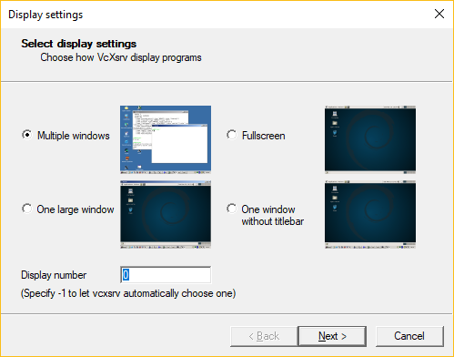

# ROS in WSL

*work in progress*

## Components
- ROS
- X Server
- Gazebo

## ROS

Follow installation as described in the distro, [Melodic](http://wiki.ros.org/melodic/Installation/Ubuntu)

## X Server

Inspiration: https://github.com/Microsoft/WSL/issues/3368#issuecomment-414717437

### Step 1 - Install [VcXsrv Windows X Server](https://sourceforge.net/projects/vcxsrv/)

### Step 2 - Launch VcXsrv through XLaunch with the following commands  
  
  
  

### Step 3 - Install `xubuntu-desktop` to suppress window manager warnings  
```
sudo apt install xubuntu-desktop
```

### Step 4 - Install `mesa-utils` to verify 3d acceleration
```
sudo apt install mesa-utils
```

### Step 5 - Set env `DISPLAY`  
Two option, go with what works for you  
```
# Option 1
export DISPLAY="localhost:0"

# Option 2
export DISPLAY="127.0.0.1:0"

# Avoid
# export DISPLAY=":0"
# means X11 over AF_UNIX on /tmp/.X11-unix/X0, not AF_INET over localhost:6000. This will cause problems in some scenarios.
```

### Step 6 - Run glxgears to verify 3d acceleration
```
glxgears
```

### Step 7 - Install gazebo 9 with bootstrap script

```
curl -sSL http://get.gazebosim.org | sh
```

### Step 8 - Run gazebo
```
gazebo --verbose
```

Expected result is 


```
Gazebo multi-robot simulator, version 9.3.1
Copyright (C) 2012 Open Source Robotics Foundation.
Released under the Apache 2 License.
http://gazebosim.org

[Msg] Waiting for master.
Gazebo multi-robot simulator, version 9.3.1
Copyright (C) 2012 Open Source Robotics Foundation.
Released under the Apache 2 License.
http://gazebosim.org

[Msg] Connected to gazebo master @ http://127.0.0.1:11345
[Msg] Publicized address: 127.0.0.1
[Msg] Waiting for master.
[Msg] Connected to gazebo master @ http://127.0.0.1:11345
[Msg] Publicized address: 127.0.0.1
```

Please note the last line, `[Msg] Publicized address: 127.0.0.1`  
This has to be a valid interface according to `ipconfig`.  
In previous builds of gazebo you had to set the env `GAZEBO_IP` equal to the value of env `DISPLAY` to force it to use the correct interface, as gazebo would grab a possible inactive interface by default. This has now been fixed.
