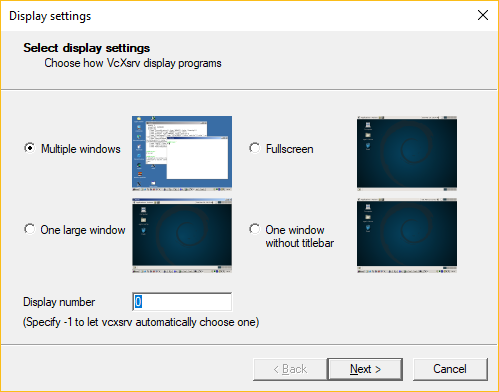
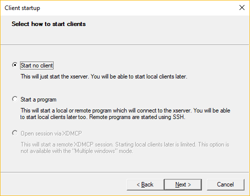
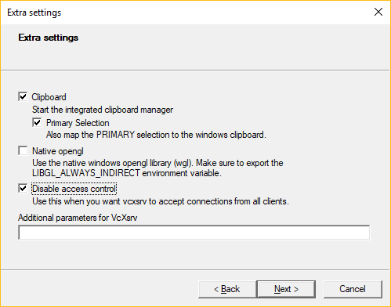

# WSL and X-Server

A component that will handle display output from wsl to windows.

1. Install [VcXsrv Windows X Server](https://sourceforge.net/projects/vcxsrv/)  

1. Launch VcXsrv through XLaunch with the following commands  
     
     
     

1. Install `xubuntu-desktop` to suppress window manager warnings  
   ```
   sudo apt install xubuntu-desktop
   ```

1. Set env `DISPLAY`  

    Two option, go with what works for you  
    ```
    # Option 1 - Gazebo wants this for my installation
    export DISPLAY="127.0.0.1:0"

    # Option 2 - Did not work for my Gazebo installation
    export DISPLAY="localhost:0"

    # Avoid
    # export DISPLAY=":0"
    # (Note from the WSL devs): "means X11 over AF_UNIX on /tmp/.X11-unix/X0, not AF_INET over localhost:6000. This will cause problems in some scenarios."
    ```

    Add your chosen option to one of your shell session scripts (for example `.bashrc` or `.zshrc`) so it will be set every time you start a new session.

    Example: My setting in `.zshrc` is
    ```
    # X-Server settings
    export DISPLAY="127.0.0.1:0"
    ```

1. Install `mesa-utils` to verify 3d acceleration

   ```
   sudo apt install mesa-utils
   ```

1. Run glxgears to verify 3d acceleration

   ```
   glxgears
   ```
   Expected output is a window with some animated gears.